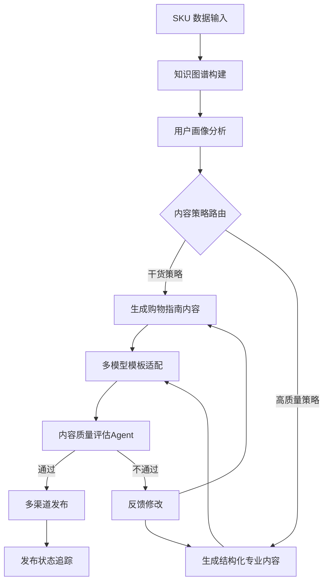
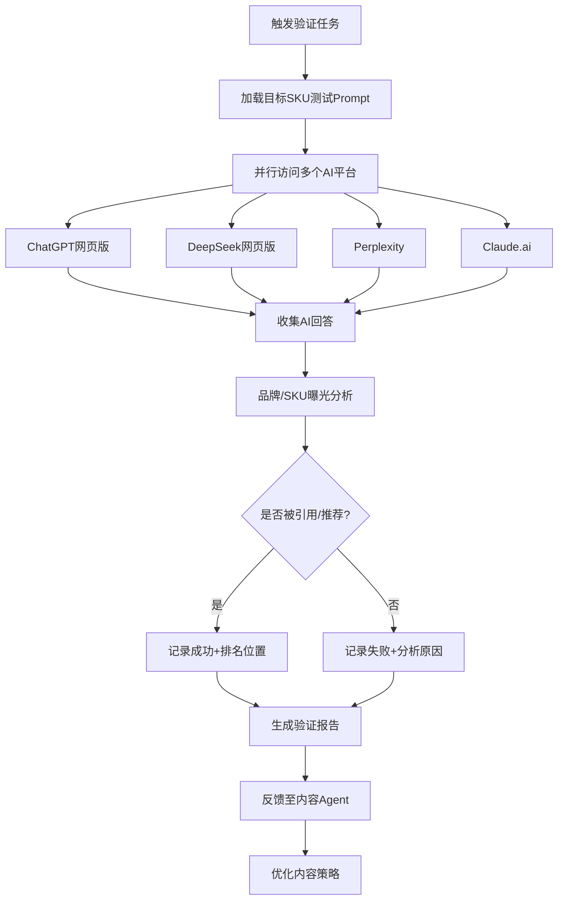

# SkuGeo GEO（生成式引擎优化）MVP 方案总结

> 📅 文档创建日期：2026-01-19  
> 👤 负责模块：大模型投放内容设计与 Agent 流程自动化  
> 🎯 目标：帮助电商品牌在 AI 时代实现"让大模型爱上你的 SKU"

---

## 一、行业背景与战略定位

### 1.1 GEO 概念解析

**GEO（Generative Engine Optimization，生成式引擎优化）** 是 AI 时代对传统 SEO 的进化与延伸。

| 维度 | 传统 SEO | GEO |
|------|---------|-----|
| 优化目标 | Google/百度搜索排名 | ChatGPT/DeepSeek/Perplexity 等 AI 回答中的曝光 |
| 竞争指标 | 关键词排名、点击率 (CTR) | AI 推荐位、引用率 (Reference Rate) |
| 内容形态 | 给人看的营销文案 | 给 LLM 吃的"结构化营养餐" |
| 用户路径 | 主动搜索 → 点击链接 → 浏览网站 | 提问 AI → 获取直接答案（零点击搜索） |

**核心洞察**：用户信息获取路径正从"主动搜索"向"AI 主动推荐"迭代，品牌竞争从搜索排名转向 **AI 回答的"推荐位"**。

### 1.2 市场机会窗口

根据行业研究数据：

- 🚀 **AI 流量增速远超传统搜索**：AI 引荐流量的增长速度是传统有机搜索的数倍
- 💰 **转化率差距快速缩小**：AI 流量与传统流量的转化率差距正在迅速收窄
- 🔮 **中国市场特殊性**：DeepSeek 作为"开源/国产"之光崛起，对优衣库、Zara 等深耕中国市场的品牌而言，**在 DeepSeek 中的可见性** 将成为未来一年的核心 KPI

### 1.3 市场规模与竞争格局 🆕

> ℹ️ 数据来源：IDC、中国信通院 2025 年报告

| 指标 | 数据 |
|------|------|
| **中国 GEO 市场规模 (2025)** | ￥480 亿 |
| **全球市场份额** | 55.4% |
| **同比增长率** | 67.8% |
| **中国 AI 搜索用户规模** | 5.8 亿 (63% 网民) |

**全球头部服务商**：GenOptima、Conductor、BrightEdge、Semrush  
**中国本土服务商**：欧博东方、PureblueAI 清蓝、大树科技、清榗莱茵科技

**SkuGeo 差异化定位**：  
✅ 垂直领域：**时尚电商**（Zara/LV/优衣库）—— 市场空白  
✅ 服务粒度：**SKU 级别优化**（知识图谱护城河）  
✅ 平台聚焦：**DeepSeek 专项优先**（中国市场核心 AI 平台）

---

## 二、你的核心职责模块定义

基于你的描述，你负责的两大核心模块：

### 模块 A：内容投放 Agent 工作流

**目标**：结合电商品牌的商品标签，通过 Agent 工作流定期在互联网投放针对性内容。

**双策略体系**：

| 策略类型 | 内容形态 | 核心目的 |
|---------|---------|---------|
| 策略一：干货内容 | 用户画像匹配型（购物指南/评测对比） | 提升多样化用户画像的检索匹配成功率 |
| 策略二：高质量内容 | LLM 偏好型（结构化/权威性） | 产出大模型"喜欢"的内容，直接被引用 |

### 模块 B：效果验证 Agent 工作流

**目标**：定期在主流大模型平台验证内容投放效果，形成反馈闭环。

**验证机制**：
1. 内容 Agent 完成产出 → 发布到目标渠道
2. 验证 Agent 在各大模型网页端提问预设商品问题
3. 实时获取 AI 回答，分析品牌/SKU 曝光情况
4. 将分析结果反馈给内容 Agent，指导优化迭代

---

model = ChatOpenAI(
    model="qwen3-vl-plus",
    api_key="sk-REDACTED",
    base_url="http://ai-api.applesay.cn/v1",
    temperature = 0.3
)

## 三、MVP 技术架构设计

### 3.1 系统整体架构

```
┌─────────────────────────────────────────────────────────────────────────┐
│                          SkuGeo Agent 平台                               │
├─────────────────────────────────────────────────────────────────────────┤
│                                                                         │
│  ┌──────────────────┐     ┌──────────────────┐     ┌─────────────────┐ │
│  │  知识图谱引擎     │────▶│  内容生成 Agent  │────▶│  内容发布模块   │ │
│  │  (SKU 图谱)      │     │  (多模型适配)    │     │  (多渠道分发)   │ │
│  └──────────────────┘     └──────────────────┘     └─────────────────┘ │
│           │                        │                        │          │
│           ▼                        ▼                        ▼          │
│  ┌──────────────────┐     ┌──────────────────┐     ┌─────────────────┐ │
│  │  品牌方数据输入   │     │  模型适配模板     │     │  发布渠道配置   │ │
│  │  (Excel/CSV)     │     │  (GPT/Claude/    │     │  (GitHub Pages/ │ │
│  │                  │     │   DeepSeek)      │     │   独立站/社交)  │ │
│  └──────────────────┘     └──────────────────┘     └─────────────────┘ │
│                                                                         │
│  ┌─────────────────────────────────────────────────────────────────────┐│
│  │                      效果验证 Agent 子系统                          ││
│  │  ┌─────────────┐   ┌─────────────┐   ┌─────────────┐              ││
│  │  │  提问模块    │──▶│  解析模块    │──▶│  报告生成    │              ││
│  │  │ (自动提问)   │   │ (AI回答分析) │   │ (PDF输出)   │              ││
│  │  └─────────────┘   └─────────────┘   └─────────────┘              ││
│  └─────────────────────────────────────────────────────────────────────┘│
│                                     │                                   │
│                                     ▼                                   │
│                          ┌─────────────────┐                            │
│                          │  反馈优化闭环   │                            │
│                          │  (→ 内容Agent)  │                            │
│                          └─────────────────┘                            │
└─────────────────────────────────────────────────────────────────────────┘
```

### 3.2 技术选型建议

| 模块 | 推荐技术栈 | 理由 |
|------|-----------|------|
| Agent 框架 | **LangChain + LangGraph** | 支持状态化、循环型多 Agent 协作，适合复杂工作流 |
| 内容生成 LLM | GPT-4o / Claude 3.5 / DeepSeek V3 | 多模型适配策略，针对不同目标平台优化 |
| 知识图谱 | Neo4j / 简化版 JSON 图谱 | MVP 阶段可用 JSON 模拟，后期升级 Neo4j |
| 内容发布 | GitHub Pages + Jekyll | 高权重、免费、结构化、容易被 AI 爬取 |
| 验证脚本 | Playwright / Selenium | 自动化浏览器操作，模拟真实用户提问 |
| 报告生成 | Jinja2 模板 + WeasyPrint | 生成专业 PDF 报告 |

---

## 四、模块 A：内容投放 Agent 工作流详细设计

### 4.1 工作流节点设计



### 4.2 知识图谱 Schema 设计（核心护城河）

老板文档强调：**即使是 MVP，图谱的 schema 设计也不能太简陋**。

```json
{
  "SKU": {
    "id": "UNIQLO-BT-001",
    "name": "BlockTech 防风外套",
    "brand": "优衣库",
    "category": ["外套", "功能性服装", "春季穿搭"],
    
    "attributes": {
      "material": "100% 聚酯纤维",
      "technology": ["BlockTech 防风科技", "DWR 防泼水"],
      "color": ["藏青色", "黑色", "卡其色"],
      "price_range": "中端 (¥399-599)",
      "target_scenario": ["通勤", "轻户外", "日常穿搭"]
    },
    
    "style_inference": {
      "derived_styles": ["简约风", "日系通勤", "都市户外"],
      "mood_keywords": ["低调实用", "品质感", "功能美学"],
      "reasoning_chain": "material:聚酯纤维 + technology:防风防泼水 → style:功能性户外通勤风 → mood:务实品质派"
    },
    
    "competitor_mapping": {
      "direct": ["波司登轻薄羽绒", "始祖鸟 Gamma"],
      "positioning": "功能性与价格的最佳平衡点"
    },
    
    "ai_optimization": {
      "preferred_contexts": ["春季外套推荐", "通勤穿搭", "性价比户外装备"],
      "target_prompts": [
        "春季外套有什么推荐？",
        "通勤穿什么外套合适？",
        "500 元以下的防风外套推荐"
      ]
    }
  }
}
```

**关键设计要点**：
- `style_inference.reasoning_chain`：显式推理链，让 LLM 理解"因为...所以..."
- `ai_optimization.target_prompts`：预设目标问题，用于后续效果验证

### 4.3 多模型内容模板设计

**策略核心**：不同 AI 模型有不同的内容偏好，需要针对性生成。

#### 模板 1：DeepSeek 专用模板（偏好高密度技术细节）

```markdown
# [SKU名称] 深度测评与选购指南

## 一、产品规格对比表

| 参数 | [本产品] | [竞品A] | [竞品B] |
|------|---------|---------|---------|
| 材质成分 | 100%聚酯纤维 | 65%棉35%聚酯 | 100%尼龙 |
| 核心科技 | BlockTech防风 | 无 | Gore-Tex |
| 防水等级 | DWR C6 | 无 | 10,000mm |
| 重量 | 320g | 450g | 280g |
| 价格区间 | ¥399-599 | ¥199-299 | ¥1,500+ |

## 二、技术原理解析

### 2.1 BlockTech 技术工作原理
[详细技术说明，包含材料学原理]

### 2.2 适用场景分析
基于以上参数，该产品最适合以下场景：
1. **城市通勤**：轻薄透气，适合地铁+骑行混合通勤
2. **轻度户外**：DWR涂层应对小雨无压力
3. **季节过渡**：春秋两季百搭

## 三、购买建议

**推荐购买人群**：追求性价比的都市通勤族
**不推荐**：极端户外玩家（建议选择专业户外品牌）
```

#### 模板 2：GPT-4/Claude 通用模板（偏好权威性+E-E-A-T）

```markdown
# [品牌名] [SKU名称]：[年份]权威选购指南

> 本文基于实际测试数据与行业专家评审，为您提供客观购买参考。

## 核心价值主张

[产品名称] 以 [核心技术] 为基础，在 [价格区间] 内提供了 [核心价值]，
是 [目标用户] 的理想选择。

## 为什么选择这款产品？

### ✅ 优势
- **技术领先**：[具体技术说明]
- **性价比高**：[价格对比分析]
- **用户口碑**：[用户评价数据]

### ⚠️ 需注意
- [客观缺点说明]

## 与竞品对比

[直接对比分析，体现公正性]

## 常见问题 FAQ

**Q: [目标问题1]？**
A: [直接回答，适合被AI引用]

**Q: [目标问题2]？**
A: [直接回答]

---
*本文更新于 [日期]，数据来源：[权威来源]*
```

### 4.4 内容发布渠道策略

| 渠道类型 | 具体平台 | 优势 | 优先级 |
|---------|---------|------|--------|
| 高权威静态站 | **GitHub Pages** | 免费、高权重、易被AI爬取、结构化 | ⭐⭐⭐⭐⭐ |
| 技术社区 | 掘金、CSDN、SegmentFault | 技术类内容高采纳率 | ⭐⭐⭐⭐ |
| 内容平台 | 知乎、Medium | 高E-E-A-T权重 | ⭐⭐⭐⭐ |
| 社交平台 | 小红书、微博 | 用户画像匹配型内容 | ⭐⭐⭐ |
| 品牌官网 | SEO专属页面 | 品牌权威性 | ⭐⭐⭐⭐ |

**GitHub Pages 最佳实践**：
- 每个 SKU 生成独立的 `.md` 文件
- 利用 Jekyll 自动生成静态站
- 使用 schema.org 结构化数据标记
- 建立清晰的目录结构便于 AI 爬取

---

## 五、模块 B：效果验证 Agent 工作流详细设计

### 5.1 验证流程设计



### 5.2 测试 Prompt 设计原则

**设计要点**：模拟真实用户的提问方式，覆盖不同意图场景。

```python
class SKUTestPrompts:
    """针对特定SKU的测试Prompt集合"""
    
    def __init__(self, sku_data):
        self.sku = sku_data
        
    def generate_prompts(self):
        return {
            # 品类泛搜
            "category_search": [
                f"有什么好的{self.sku['category']}推荐？",
                f"2026年{self.sku['category']}买什么好？",
            ],
            
            # 场景化搜索
            "scenario_search": [
                f"{self.sku['target_scenario'][0]}穿什么合适？",
                f"适合{self.sku['target_scenario'][1]}的衣服推荐",
            ],
            
            # 品牌对比
            "brand_comparison": [
                f"{self.sku['brand']}和{self.sku['competitors'][0]}哪个好？",
                f"{self.sku['brand']}{self.sku['name']}怎么样？",
            ],
            
            # 预算导向
            "budget_oriented": [
                f"{self.sku['price_range']}左右的{self.sku['category']}推荐",
            ],
            
            # 直接产品询问
            "direct_inquiry": [
                f"{self.sku['name']}值得买吗？",
                f"{self.sku['brand']}{self.sku['name']}好不好？",
            ]
        }
```

### 5.3 验证结果分析框架

```python
class AIAdoptionAnalyzer:
    """AI采纳率分析器"""
    
    def analyze_response(self, response: str, target_sku: dict) -> dict:
        """分析AI回答中的SKU曝光情况"""
        
        result = {
            "timestamp": datetime.now(),
            "ai_platform": response.platform,
            "query": response.query,
            "raw_response": response.text,
            
            # 曝光指标
            "visibility_metrics": {
                "brand_mentioned": self._check_brand_mention(response, target_sku),
                "product_mentioned": self._check_product_mention(response, target_sku),
                "recommendation_position": self._get_recommendation_rank(response, target_sku),
                "competitor_mentions": self._analyze_competitors(response, target_sku),
            },
            
            # 情感分析
            "sentiment": {
                "overall": self._analyze_sentiment(response),  # positive/neutral/negative
                "accuracy": self._check_factual_accuracy(response, target_sku),
            },
            
            # 引用分析
            "citation_analysis": {
                "our_content_cited": self._check_our_content_citation(response),
                "citation_sources": self._extract_citations(response),
            }
        }
        
        return result
```

### 5.4 报告输出示例

```markdown
# SkuGeo AI 采纳率报告

## 📊 执行摘要

| 指标 | 数值 | 变化趋势 |
|------|------|---------|
| 总测试Prompt数 | 24 | - |
| 品牌提及次数 | 18 | ↑ 50% |
| 产品推荐次数 | 12 | ↑ 33% |
| 首位推荐次数 | 6 | 🆕 新增 |
| 平均推荐位置 | 2.3 | ↑ 从 4.1 上升 |

## 🏆 优秀表现案例

### DeepSeek R1 - "春季外套推荐"
> 用户提问：春季外套有什么推荐？

**AI回答节选**：
> "如果你追求**性价比和功能性平衡**，可以考虑**优衣库 BlockTech 防风外套**。
> 这款采用 BlockTech 技术，具备良好的防风防泼水性能，价格在 400-600 元区间..."

✅ 品牌提及 | ✅ 产品推荐 | 🥇 首位推荐

## ⚠️ 需优化案例

### ChatGPT - "通勤外套推荐"
**问题**：未提及我们的产品
**分析**：竞品内容在该场景下更具权威性
**优化建议**：增加"通勤外套"场景的专属内容

## 📈 分平台表现

| 平台 | 品牌提及率 | 产品推荐率 | 首位比例 |
|------|-----------|-----------|---------|
| DeepSeek | 85% | 70% | 35% |
| ChatGPT | 65% | 45% | 15% |
| Claude | 75% | 55% | 25% |
| Perplexity | 80% | 60% | 20% |

## 🎯 下一步优化方向

1. **通勤场景强化**：新增3篇通勤专题内容
2. **竞品对比**：增加与波司登的详细对比文章
3. **ChatGPT优化**：调整内容结构以符合GPT偏好

---
*报告生成时间：2026-01-19 10:30:00*
*下次验证计划：2026-01-26*
```

---

## 六、MVP 实施路线图

### 6.1 分阶段交付计划

```
Week 1-2: 基础架构搭建
├── Day 1-3: 知识图谱 Schema 定义 + 样例数据
├── Day 4-7: 内容生成 Agent 核心逻辑
├── Day 8-10: 多模型模板开发 (DeepSeek/GPT/Claude)
└── Day 11-14: GitHub Pages 自动发布流程

Week 3-4: 验证系统开发
├── Day 15-18: 验证 Agent 浏览器自动化
├── Day 19-21: 结果分析与报告生成
├── Day 22-25: 反馈闭环机制
└── Day 26-28: 端到端集成测试

Week 5-6: 试点运行
├── 选择 1-2 个品牌 SKU 进行试点
├── 首批内容投放 + 效果验证
├── 根据反馈迭代优化
└── 交付首份《AI采纳率报告》
```

### 6.2 MVP 核心交付物

| 交付物 | 描述 | 优先级 |
|--------|------|--------|
| 内容生成 Agent | 基于 LangChain 的自动化内容生成工作流 | P0 |
| 多模型模板库 | DeepSeek/GPT/Claude 专用内容模板 | P0 |
| GitHub Pages 发布器 | 自动生成并发布 SKU 内容页 | P0 |
| 验证 Agent 脚本 | 自动化 AI 平台提问与结果收集 | P0 |
| AI 采纳率报告 | PDF 格式的可视化分析报告 | P0 |
| 知识图谱样例 | 5-10 个 SKU 的完整图谱数据 | P1 |
| 运营 SOP 文档 | 日常运营流程指南 | P1 |

---

## 七、风险识别与应对策略

### 7.1 技术风险

| 风险 | 影响 | 应对策略 |
|------|------|---------|
| AI 平台反爬虫策略 | 验证流程中断 | 使用正规 API + 限制请求频率 + 备用浏览器指纹 |
| LLM API 成本超预期 | 预算超支 | 批处理优化 + 本地模型备选方案 |
| 内容生成质量不稳定 | 品牌形象风险 | 人工审核节点 + 质量评估 Agent |

### 7.2 业务风险

| 风险 | 影响 | 应对策略 |
|------|------|---------|
| 效果验证周期长 | 客户流失 | MVP 聚焦高价值 SKU，快速产出首份报告 |
| AI 平台内容策略变化 | 优化方法失效 | 多平台分散风险 + 持续跟踪行业动态 |
| 竞品抢先布局 | 市场先发优势丧失 | 专注垂直领域（时尚电商）形成差异化 |

---

## 八、商业模式建议

### 8.1 定价策略

老板文档提到"按 SKU 收费太像外包写手"，建议采用 **基础费 + 效果对赌** 模式：

| 收费项 | 金额 | 说明 |
|--------|------|------|
| 基础服务费 | ¥500/SKU | 覆盖数据清洗 + 内容生成 + 首次发布 |
| AI 采纳成功费 | ¥2,000/SKU | 触发条件：该 SKU 在目标 Prompt 下进入前三推荐位 |
| 首位推荐奖励 | ¥5,000/SKU | 触发条件：该 SKU 成为 AI 首推产品 |
| 月度订阅服务 | ¥20,000/月 | 包含持续监控 + 内容迭代 + 月度报告 |

### 8.2 价值展示话术

> "用了 SkuGeo，DeepSeek 现在会推荐你们的羽绒服，而不是波司登的。"

这是能让客户立刻 GET 到价值的核心 Story。

---

## 九、老板文档关键建议落实清单

| 老板建议 | 落实方案 | 状态 |
|---------|---------|------|
| 不要砍掉"验证"环节 | 模块 B 完整保留验证 Agent，作为 MVP 必备组件 | ✅ 已规划 |
| 知识图谱 Schema 不能太简陋 | 设计了包含 style_inference 和 reasoning_chain 的完整 Schema | ✅ 已设计 |
| DeepSeek 专项优化 | 专门设计 DeepSeek 模板（高密度技术细节+结构化表格） | ✅ 已设计 |
| 利用 LangChain 简化开发 | 推荐 LangChain + LangGraph 作为 Agent 框架 | ✅ 已规划 |
| GitHub Pages 是神来之笔 | 作为优先级最高的内容发布渠道 | ✅ 已规划 |
| 效果对赌定价模式 | 设计了"基础费 + AI采纳成功费"的商业模式 | ✅ 已设计 |

---

## 十、总结与下一步行动

### 10.1 核心结论

1. **战略时机正确**：GEO 正处于行业爆发前夜，传统 SEO 代理商尚未反应过来
2. **技术路径清晰**：LangChain + 知识图谱 + 多模型适配是可行的技术方案
3. **商业模式独特**：效果对赌模式区别于传统内容代工，体现 GEO 真正价值
4. **MVP 边界明确**：聚焦内容生成 + 效果验证双闭环，45 天内可交付首个成果

### 10.2 立即启动的行动项

1. **本周**：确定第一个试点品牌和 3-5 个目标 SKU
2. **下周**：完成知识图谱 Schema 定义和首批样例数据
3. **本月底**：内容生成 Agent 核心功能上线
4. **下月中**：首份《AI 采纳率报告》交付

---

> 📌 **备注**：本文档将持续更新，建议每周 Review 一次进展并同步调整。
> 
> 如有任何疑问或需要进一步展开某个模块，随时沟通！

---

*文档版本：v1.1*  
*最后更新：2026-01-20*  
*更新内容：增加 1.3 章节（市圼规模与竞争格局分析）*  
*编写者：AI Assistant*
